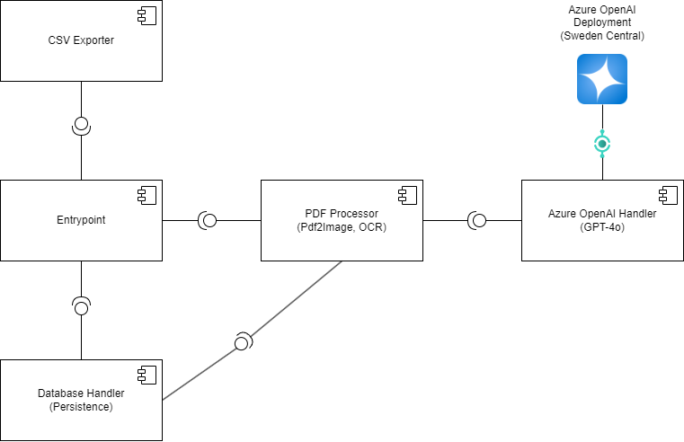

# AI Bank Statement Aggregation

This software implements the "Bank Statement Aggregation" assignment of the "Advanced Methods of AI" course.

The software takes pdf documents of bank statements as an input, crops the pdfs to the sections containing
the transfers and then uses GPT-4o's OCR function for text extraction. Afterwards, GPT-4o's reasoning is consulted
to extract the transfer data (dates of transfer, transfer-reasons, transfer amounts) in JSON format, which is finally
parsed by the program and written to the Sqlite3 Database.

While the Sqlite3 Database is mounted as a volume, the software also generates a CSV output of the transfers in the "export" directory.

## Requirements

To run the software, an Azure OpenAI deployment is required. The application and deployment process is quite straightforward:

1. Navigate to `https://portal.azure.com`
2. Sign in with your Azure/Live/Microsoft account.
3. Ensure you have an Azure subscription - students have access to 100 days and 200$ in Azure credit for free.
4. Search and then navigate to the Azure OpenAI service.
5. Create a new deployment.

After the deployment is complete, navigate to the created resource and click "Explore Azure AI Foundry Portal" (as of January 2025).

To gain access to OCR through GPT-4o without running into rate limits, you need to apply for a new quota:

1. Click on "Deployments"
2. Click on "Deploy model" and select "GPT-4o"
3. You will get the message that you don't have available quota - click the error link, which takes you to the quotas page.
4. On the quotas page, click on "Request quota" and fill the form.
   - A quota of 300 (300k Tokens per minute) is more than sufficient.
   - The quota should be assigned within 72 hours.

You will get an email as soon as the quota is assigned. When it is, simply go back to the deployments page and deploy the 4o Model.

## Setup

Before starting the software, perform the following setup-steps:

1. Put the bank transfer PDFs into the directory `source`.
2. Create an env file `.env` and define the variable `OPENAI_API_KEY`. Your Azure OpenAI-Deployment **must** have access to a GPT-4o model.
	- Under the `ai` directory, adjust the `OPENAI_API_BASE` to the URL of your Azure OpenAI deployment.

*If any data is missing or misconfigured, the app wont start and the logs will display informative error-logs with the required actions.*

## Execution

To run the software, simply execute `docker compose up` in the project's root.

The database with the client's account and transaction data will be written to the `export` directory alongside the
csv files which contain formatted exports of the transactions for each document. The document names correlate to the names
of the pdf files.

The processed PDF files can be found in the `dest` directory, the documents that failed to process are in the `failed` directory.

## Demo

In the [demo](demo) directory, you can find a demo of the software in action.

### Demo with modern documents

### Demo with old documents

## System Architecture

---

# Legal and Licensing Disclaimer

**Ownership and Scope of Use**

This software and all associated files, including but not limited to code modules, scripts, and snippets, are the intellectual property of their respective authors as annotated by Git Blame unless explicitly defined in the file headers. Ownership is retained unless explicitly transferred or licensed in writing. This software is provided exclusively for use within the context of this course, subject to the terms outlined herein.

**Permitted Use**

The use of this software is strictly limited to personal and educational purposes within the scope of the course for which it was shared. No part of this software may be copied, modified, distributed, sold, or otherwise exploited for private, public, or commercial purposes outside of this context without prior written permission from the owner.  

**Prohibited Actions**

The following actions are strictly prohibited unless explicitly authorized by the owner in writing:  

1. Replication, distribution, or redistribution of this software or its components in any form, whether modified or unmodified.  
2. Sale, licensing, sublicensing, or other commercialization of this software, including its use as part of a proprietary or commercial product.  
3. Removal, modification, or obfuscation of ownership declarations in file headers or associated documentation.  

**Liability Disclaimer**

This software is provided "as is," without warranty of any kind, either express or implied, including but not limited to the implied warranties of merchantability and fitness for a particular purpose. The owner(s) shall not be held liable for any direct, indirect, incidental, special, exemplary, or consequential damages arising in any way from the use of this software.  

**Enforcement**

Unauthorized use, reproduction, or distribution of this software may result in legal action. By using this software, you acknowledge and agree to the terms outlined in this document.  

**Notice**

If you intend to use any portion of this software outside the scope of the course, you must obtain explicit written permission from the owner(s). All requests for use should include a detailed description of the intended purpose and scope of use.  

**Contact Information**

For permissions or inquiries, please contact the respective owner as indicated in the file headers.
